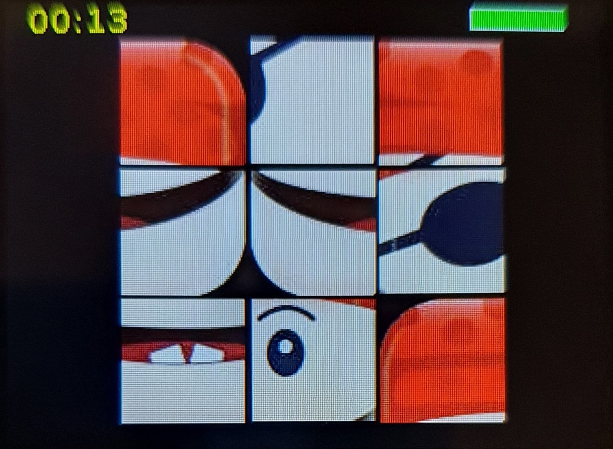

# Escape Room Game

## Hardware required
* M5Stack Core 2
* SD card for all the files in the sd/ directory
* Color sensor (Grove)
* Light sensor (Grove)
* Grove cable
* 3 digit lock (optional) (The two sensores and the cable should be in a box with this lock)

## Start game
Insert the SD card with the files, and copy the file escape-room.py to the M5Stack and start the file. The game should now start and the rest of the game is the follow the instructions on the screen and guess how to proceed. The game will take app. 5-10 minutes to solve.
(The few texts in the game is in danish, but that should not be a problem)

## Some screenshots from the game
    

## Demo of the game (walk through)
https://www.youtube.com/watch?v=oaEdlZQjHWA
